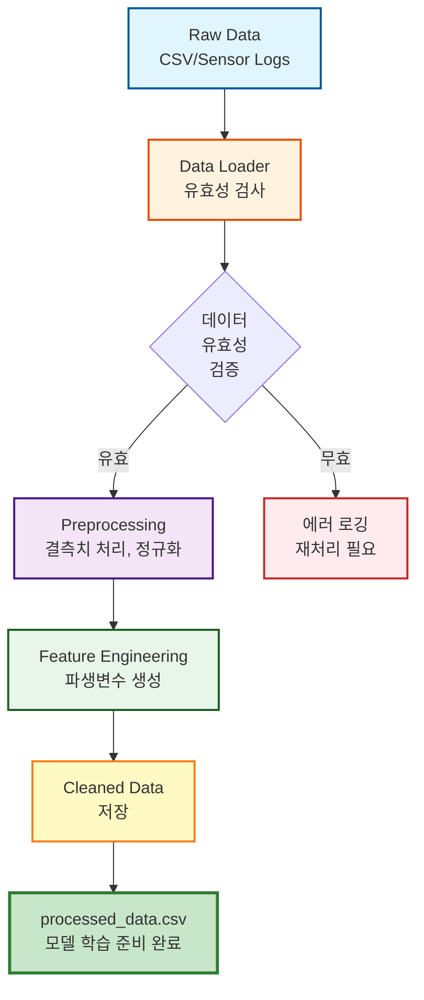

# Wafer Defect Detection Data Pipeline

반도체 공정 데이터의 특성을 이해하고, 안정적인 데이터 처리를 위한 ETL 프로세스를 구축한 데이터 파이프라인 프로젝트입니다. 본 프로젝트는 웨이퍼 결함 데이터를 체계적으로 수집, 정제, 변환하여 머신러닝 모델에 활용 가능한 형태로 가공하는 전체 데이터 엔지니어링 프로세스를 다룹니다.

## 📋 프로젝트 개요

반도체 제조 공정에서 발생하는 웨이퍼 결함 데이터를 처리하는 데이터 파이프라인을 구현했습니다. 원시 데이터(Raw Data)로부터 시작하여 데이터 클리닝, 피처 엔지니어링을 거쳐 최종적으로 모델 학습에 사용 가능한 데이터셋을 생성하는 전체 ETL 프로세스를 자동화했습니다.

## 🏗️ Architecture

데이터 파이프라인은 다음과 같은 단계로 구성됩니다:



### 파이프라인 단계별 상세 설명

1. **Raw Data (CSV/Sensor Logs)**
   - 원본 데이터 입력 (63,909 rows × 25 columns)
   - 반도체 공정 센서 로그 및 결함 데이터

2. **Data Loader (유효성 검사)**
   - 파일 존재 여부 확인
   - 데이터 타입 검증
   - 빈 데이터셋 체크
   - 인코딩 검증

3. **Preprocessing (결측치 처리, 정규화)**
   - 이상치 제거 (IQR 방법, Class별 처리)
   - 데이터 타입 정합성 확보
   - 결측치 처리
   - 수치 정규화

4. **Feature Engineering (파생변수 생성)**
   - 파생 변수 생성 (SNR, Aspect Ratio, Density 등)
   - 무한대 값(inf) 처리 및 정규화
   - 클러스터링 기반 라벨링 (K-Means)

5. **Cleaned Data 저장**
   - 처리된 데이터 CSV 저장
   - 모델 학습 준비 완료 데이터셋 생성

### 데이터 흐름 상세 설명

1. **Raw Data → Data Cleaning**
   - 원본 CSV 파일 로드 (63,909 rows × 25 columns)
   - Class별 그룹화를 통한 이상치 탐지 및 제거
   - 데이터 타입 검증 및 변환

2. **Data Cleaning → Feature Engineering**
   - 도메인 지식 기반 파생 변수 생성
   - 수치적 안정성을 고려한 계산식 적용
   - 공정별(Step_desc) 특성 반영한 클러스터링 수행

3. **Feature Engineering → Ready for Model**
   - Killer Defect 라벨링 완료
   - 모델 학습에 필요한 모든 피처 준비 완료
   - 처리된 데이터 CSV 저장

## 🛠️ Technical Skills

### 핵심 기술 스택

- **Python 3.x**: 메인 프로그래밍 언어
- **Pandas**: 데이터 조작 및 변환 (DataFrame 기반 ETL)
- **NumPy**: 수치 연산 및 배열 처리
- **scikit-learn**: 데이터 전처리 및 클러스터링 (StandardScaler, KMeans)

### 데이터 엔지니어링 기법

- **Type Hinting**: 모든 함수에 타입 힌트 적용으로 코드 가독성 및 유지보수성 향상
- **Data Preprocessing**: 
  - IQR(Interquartile Range) 기반 이상치 제거
  - 그룹별(Class) 통계 기반 데이터 정제
  - 무한대 값(inf, -inf) 처리
- **Feature Engineering**: 도메인 특성 반영한 파생 변수 생성
- **Modular Design**: 객체지향 및 함수형 프로그래밍 패러다임 혼용

## 📁 프로젝트 구조

```
Wafer_Defect_Final/
├── src/
│   ├── __init__.py              # 패키지 초기화
│   ├── data_loader.py          # 데이터 로드 모듈
│   └── preprocessing.py        # 전처리 모듈
├── main.py                      # 메인 파이프라인 실행 스크립트
├── dataset.csv                  # 원본 데이터셋
├── processed_data/              # 처리된 데이터 저장 디렉토리
│   └── processed_data.csv
├── requirements.txt             # 패키지 의존성
└── README.md                    # 프로젝트 문서
```

## 🚀 사용 방법

### 1. 환경 설정

```bash
pip install -r requirements.txt
```

### 2. 파이프라인 실행

```bash
python main.py
```

### 3. 모듈별 사용 예시

#### 데이터 로드
```python
from src.data_loader import DataLoader, load_data

# 객체지향 방식
loader = DataLoader()
df = loader.load_raw_data()

# 함수형 방식
df = load_data()
```

#### 데이터 전처리
```python
from src.preprocessing import DataPreprocessor

preprocessor = DataPreprocessor()

# 전체 파이프라인 실행
processed_df = preprocessor.preprocess(df)

# 단계별 실행
cleaned_df = preprocessor.remove_outliers_by_class(df)
df_with_features = preprocessor.add_engineered_features(cleaned_df)
clustered_df = preprocessor.run_kmeans_by_step(df_with_features)
final_df = preprocessor.label_killer_defects(clustered_df)
```

## 🔧 Troubleshooting & Data Quality Assurance

### 데이터 타입 문제 해결

**문제**: CSV 로드 시 숫자형 컬럼이 문자열로 인식되거나, nullable 정수형이 제대로 처리되지 않는 경우

**해결 방법**:
- `pd.read_csv()` 로드 후 명시적 타입 검증 수행
- 클러스터링 결과 저장 시 `pd.NA`와 `Int64` 타입을 사용하여 결측치를 안전하게 처리
- 모든 수치 연산 전에 데이터 타입 확인 및 변환

```python
# 예시: nullable 정수형 처리
df["KMeans_Cluster"] = pd.Series(pd.NA, index=df.index, dtype="Int64")
df["KMeans_Cluster"] = df["KMeans_Cluster"].astype("Int64")
```

### 이상치 처리 및 데이터 정합성 확보

**문제**: 반도체 공정 데이터의 특성상 Class별로 분포가 다르며, 전체 데이터에 동일한 임계값을 적용하면 일부 Class의 정상 데이터가 이상치로 오분류됨

**해결 방법**:
- **Class별 그룹화 기반 IQR 방법 적용**: 각 Class 그룹에 대해 독립적으로 Q1, Q3, IQR을 계산하여 상위 이상치(Q3 + 1.5 × IQR) 제거
- **최소 샘플 수 검증**: 각 Class 그룹의 샘플 수가 2개 미만인 경우 이상치 제거 스킵하여 데이터 손실 방지
- **IQR = 0 처리**: 분산이 없는 경우(IQR = 0) 이상치 제거 로직을 건너뛰어 안정성 확보

```python
# Class별 이상치 제거 로직
for class_id, group in df.groupby("Class"):
    q1 = group[col].quantile(0.25)
    q3 = group[col].quantile(0.75)
    iqr = q3 - q1
    if iqr == 0:
        continue  # 분산이 없으면 스킵
    upper_bound = q3 + 1.5 * iqr
    filtered = group[group[col] <= upper_bound]
```

**결과**: 63,909개 원본 데이터 중 12,178개(19.06%) 이상치 제거, 데이터 정합성 확보

### 무한대 값(Infinity) 처리

**문제**: 파생 변수 생성 시 분모가 0에 가까운 경우 나눗셈 연산으로 인해 `inf` 또는 `-inf` 값 발생

**해결 방법**:
- **작은 상수(epsilon) 추가**: 분모에 `1e-6`을 더하여 0으로 나누는 상황 방지
- **명시적 inf 처리**: `replace([np.inf, -np.inf], np.nan)`을 통해 무한대 값을 NaN으로 변환
- **후속 처리**: NaN 값은 모델 학습 단계에서 적절히 처리되도록 설계

```python
# 예시: SNR 파생 변수 생성
df["SNR_OFFSET_GL"] = df["MDAT_OFFSET"] / (df["MDAT_GL"] + 1e-6)
df["SNR_OFFSET_GL"] = df["SNR_OFFSET_GL"].replace([np.inf, -np.inf], np.nan)
```

### 결측치 처리 전략

**문제**: 클러스터링은 실제 결함(IS_DEFECT == 'REAL')에만 수행되므로, 거짓 결함(FALSE) 데이터는 클러스터 라벨이 없음

**해결 방법**:
- **Nullable 타입 사용**: `pd.NA`를 사용하여 결측치를 명시적으로 표현
- **타입 안정성**: `Int64` 타입을 사용하여 정수형이면서도 결측치를 안전하게 처리
- **조건부 처리**: 클러스터링이 수행되지 않은 데이터는 라벨링 단계에서 자동으로 제외

### 데이터 검증 체크리스트

파이프라인 실행 후 다음 사항을 확인하여 데이터 정합성을 보장합니다:

- [ ] 원본 데이터 행 수 대비 처리된 데이터 행 수 비율 확인
- [ ] 각 단계별 컬럼 수 변화 추적
- [ ] Class별 데이터 분포 균형 확인
- [ ] 파생 변수 생성 후 inf/NaN 발생 여부 확인
- [ ] 클러스터링 결과 분포 확인 (각 공정별 클러스터 수)

## 📊 처리 결과

- **원본 데이터**: 63,909 rows × 25 columns
- **이상치 제거 후**: 51,731 rows (12,178개 제거, 19.06%)
- **파생 변수 추가 후**: 51,731 rows × 29 columns (4개 파생 변수 추가)
- **최종 데이터**: 51,731 rows × 31 columns (클러스터링 및 라벨링 완료)
- **Killer Defect 식별**: 13,697개

## 📝 주요 파생 변수

1. **SNR_OFFSET_GL**: `MDAT_OFFSET / (MDAT_GL + 1e-6)` - 신호 대 노이즈 비율
2. **SNR_INTENSITY_NOISE**: `INTENSITY / (PATCHNOISE + 1e-6)` - 강도 대 노이즈 비율
3. **ASPECT_RATIO**: `SIZE_X / (SIZE_Y + 1e-6)` - 결함 형태 비율
4. **DENSITY_SIGNAL**: `INTENSITY / (DEFECT_AREA + 1e-6)` - 신호 밀도

## 🔍 데이터 품질 지표

- **데이터 손실률**: 19.06% (이상치 제거)
- **파생 변수 생성 성공률**: 100% (inf 값 안전 처리)
- **클러스터링 커버리지**: 실제 결함 데이터의 100% (거짓 결함 제외)
- **타입 일관성**: 모든 수치 연산 전 타입 검증 완료

## 📚 참고 자료

- 반도체 공정 데이터 특성 이해
- IQR 기반 이상치 탐지 방법론
- 데이터 파이프라인 설계 패턴

## 👤 Author

데이터 엔지니어 직무 지망자

---

**Note**: 본 프로젝트는 데이터 분석보다는 **데이터 파이프라인 구축**에 중점을 둔 프로젝트입니다. 안정적이고 확장 가능한 ETL 프로세스를 통해 데이터 품질을 보장하고, 재현 가능한 데이터 처리 워크플로우를 구현했습니다.
